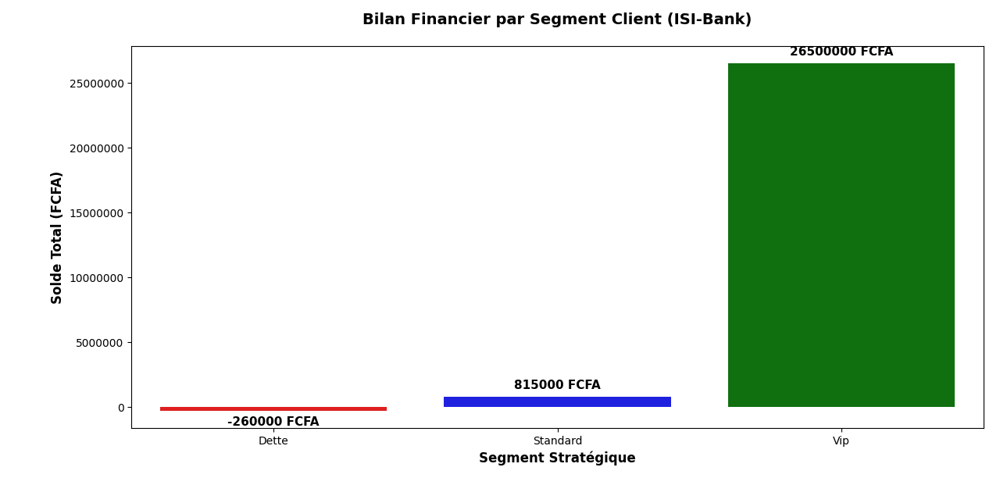

# 🏦 Portfolio Data : Audit de Risque et Segmentation Client (ISI-Bank)

**Rôle :** Data Analyst
**Outils utilisés :** Python (Pandas, NumPy, Seaborn, Matplotlib)

## 🎯 Le Contexte Métier
La direction d'ISI-Bank nécessitait une vision claire de l'exposition au risque de son portefeuille client. La base de données initiale présentait des anomalies critiques pour la prise de décision (doublons, valeurs manquantes, erreurs de typage).

## 🛠️ Mes Missions (Pipeline Data)
1. **Data Cleaning :** Assainissement de la base de données (traitement des `NaN`, suppression des doublons, conversion des formats `datetime`).
2. **Feature Engineering :** Création d'un système de drapeaux d'alerte et segmentation financière des clients (Dette, Standard, VIP) via des intervalles de valeurs continues (`pd.cut` & `-np.inf`).
3. **Data Aggregation :** Compression des données transactionnelles par segment stratégique (`groupby`).
4. **Data Visualization :** Conception d'un rapport visuel COMEX automatisé avec respect de la psychologie des couleurs financières.

## 📊 Le Résultat (Livrable COMEX)
Voici la modélisation finale compressée et segmentée pour la prise de décision stratégique du management :

**Rôle :** Data Analyst
**Outils utilisés :** Python (Pandas, NumPy, Seaborn, Matplotlib)

## 🎯 Le Contexte Métier
La direction d'ISI-Bank nécessitait une vision claire de l'exposition au risque de son portefeuille client. La base de données initiale présentait des anomalies critiques pour la prise de décision (doublons, valeurs manquantes, erreurs de typage).

## 🛠️ Mes Missions (Pipeline Data)
1. **Data Cleaning :** Assainissement de la base de données (traitement des `NaN`, suppression des doublons, conversion des formats `datetime`).
2. **Feature Engineering :** Création d'un système de drapeaux d'alerte et segmentation financière des clients (Dette, Standard, VIP) via des intervalles de valeurs continues (`pd.cut` & `-np.inf`).
3. **Data Aggregation :** Compression des données transactionnelles par segment stratégique (`groupby`).
4. **Data Visualization :** Conception d'un rapport visuel COMEX automatisé avec respect de la psychologie des couleurs financières.

## 📊 Le Résultat (Livrable COMEX)
Voici la modélisation finale compressée et segmentée pour la prise de décision stratégique du management :

